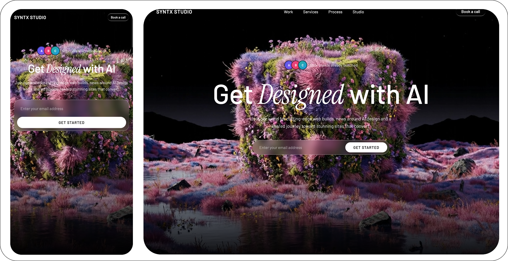
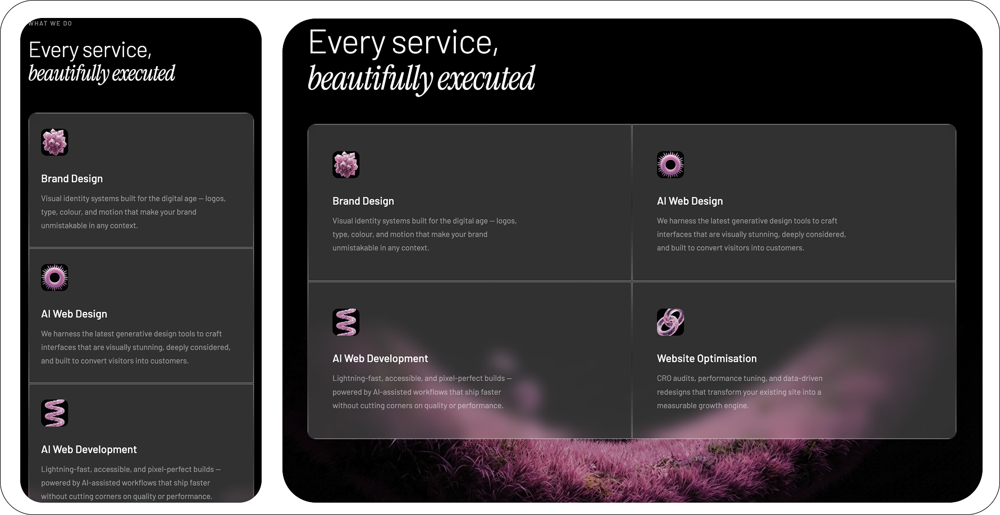
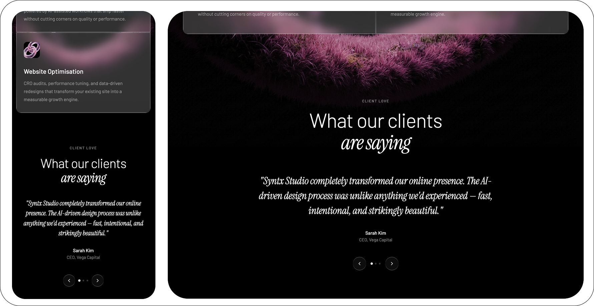
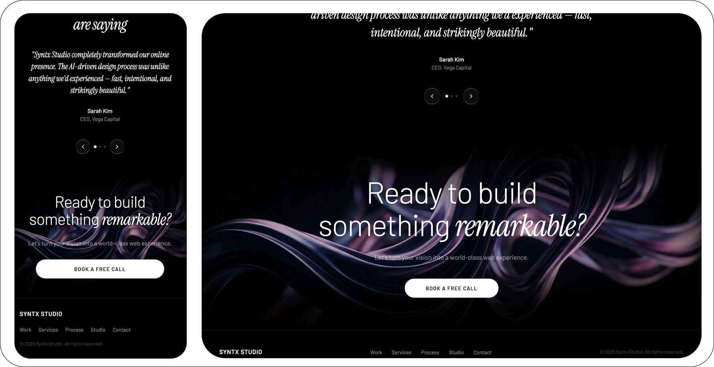

# AI Agency Landing

A modern one-page landing website for an AI-focused design studio, built to showcase services with premium visuals, cinematic transitions, and conversion-oriented structure.

## Overview

This project is a marketing landing page that combines clean frontend implementation with AI-assisted creative production.

Core goals:

- Present agency services in a clear, high-end format.
- Create smooth visual flow between sections.
- Use modern UI effects (glassmorphism, layered shadows, fade transitions).
- Keep the page lightweight and easy to customize.

## Implemented Sections

- Hero
- Our Approach
- Selected Work
- What We Do
- Client Love (Testimonials)
- CTA (`Ready to build something remarkable?`)
- Footer

## Visual Highlights

- Frosted-glass service cards in the `What We Do` section.
- Split-image transition between `What We Do` and `Client Love` using `public/separate.png`.
- CTA background art using `public/footer-bg.png`.
- Soft top/bottom shadow blending for non-abrupt section transitions.
- Consistent dark premium visual style across the page.

## AI Tools Used

This project was produced with support from multiple AI tools:

- **Nanobanana**: visual asset ideation and creative reference support.
- **Kling AI**: motion/visual inspiration and media direction for dynamic sections.
- **Claude**: iterative implementation support, layout refinements, and content/UX polishing.

## Tech Stack

- HTML5
- CSS3
- Vanilla JavaScript

No external framework is required to run this version.

## Project Structure

```text
.
├── index.html
├── public/
│   ├── 1.png
│   ├── 2.png
│   ├── 3.png
│   ├── 4.png
│   ├── separate.png
│   └── footer-bg.png
├── screenshots/
│   ├── 1.png
│   ├── 2.png
│   ├── 3.png
│   ├── 4.png
│   └── 5.png
└── README.md
```

## Screenshots

Replace these placeholders with final mockups:







## Run Locally

Open `index.html` in your browser, or use a simple local server:

```bash
python3 -m http.server 8000
```

Then open `http://localhost:8000`.

## Notes

- Design and transitions are tuned for dark backgrounds.
- You can quickly swap branding by replacing text and assets in `public/`.
- Mockup images are expected in `screenshots/1.png` to `screenshots/5.png`.
